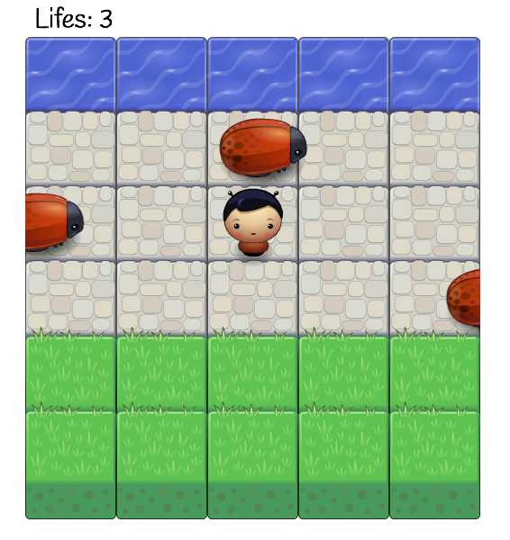

# FEND Udacidy - Classic Arcade Game Project 

##### Project scope - code
* OOP JavaScript - Game objects (player and vehicles) are implemented using JavaScript object-oriented programming features,
* HTML5 canvas. 
* Font-awesome and Google fonts used: 'Handless'.

Game functions correctly and runs error free:

1. Player can not move off screen,
2. Bugs cross the screen,
3. Bugs-player collisions happen logically (not too early or too late),
4. Bugs-player collision resets the game,
5. Bugs-player collision decreases the lifes score,
6. When player get to the top of the gameboard, wins and lifes score increases. 

##### How to play arcade game?
Move the player using the arrowKeys on your keyboard across the gameboard, try to get to the river (top row) by avoiding the bugs.
Colliding with th bugs decreases the lifes score, and reaching the top row increases the lifes score.   

## Preview

## Installation
1. Download the folders and files to your computer.
2. Open the index.html file in your browser. 

